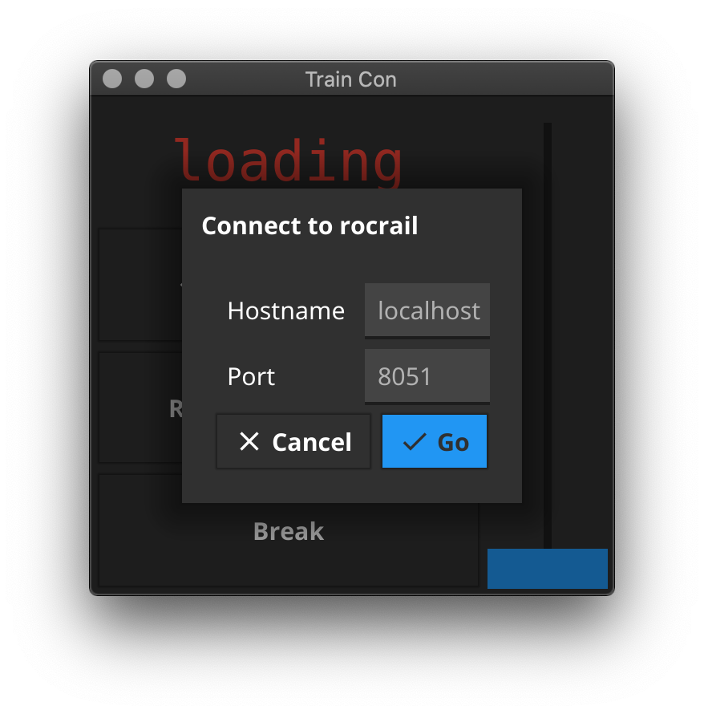
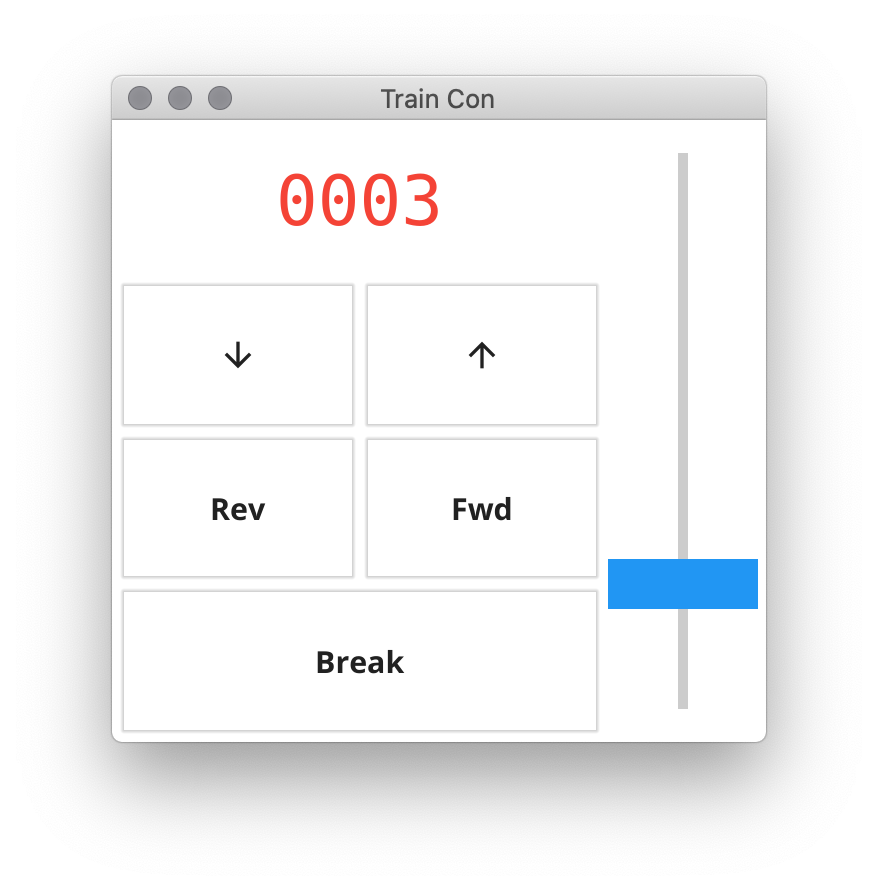

# TrainCon

This app for your computer and smartphone allows you to control your DCC
model trains from your favourite device :).

Using any running [rocrail](https://wiki.rocrail.net/doku.php)
server this app can put you in the cab from your phone.

## Running 

First grab the code either from the repo or using the go tools.

    $ go get github.com/andydotxyz/traincon
    $ traincon

You will see a login screen (this is for a computer using dark mode):

Once you have entered the IP address or DNS name of your rocrail server the
app will move to train control mode (showing light mode below):

